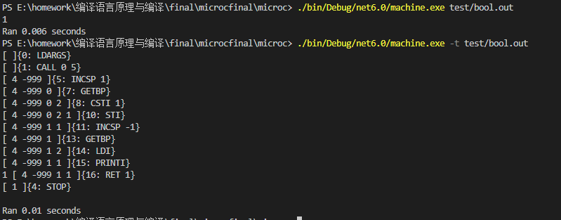
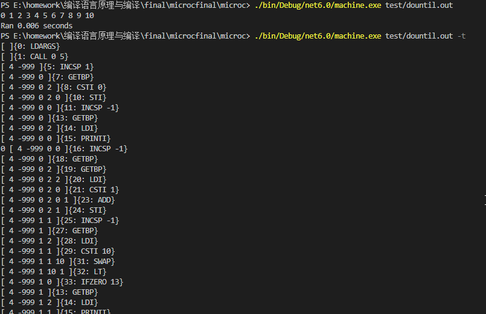
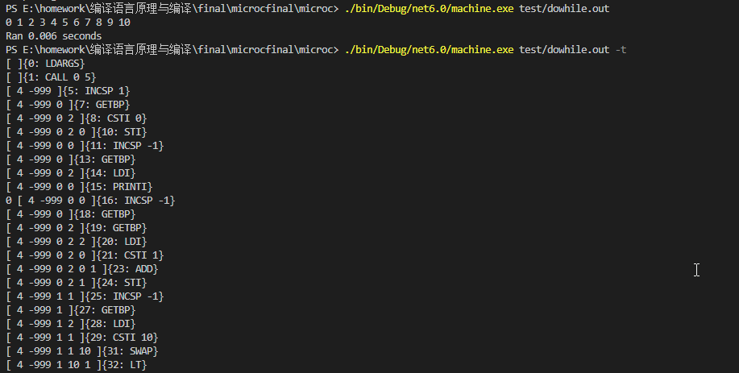
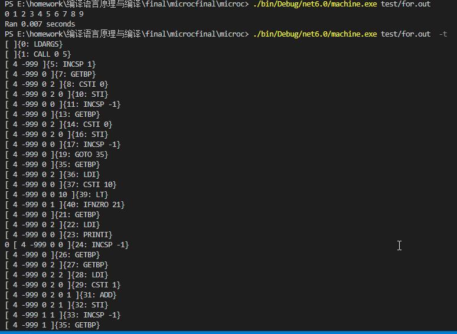
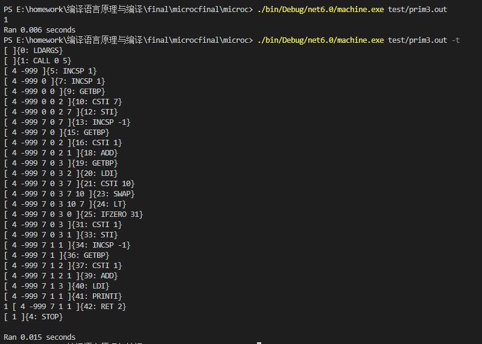
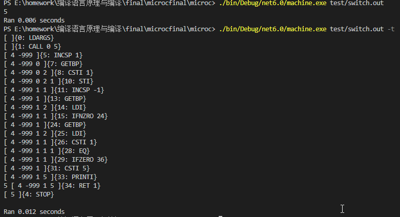
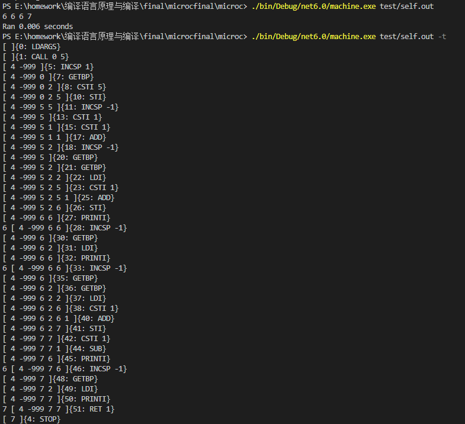

[2020-2021学年第2学期]

# [**实 验 报 告**]


- 课程名称:编程语言原理与编译
- 实验项目:期末大作业
- 专业班级__<u>计算机1902</u>_
- 学生学号 <u>_31901050_ 31901298_</u>
- 学生姓名 <u>饶黎明 孙天熔</u>
- 实验指导教师:郭鸣

| 姓名   | 学号     | 班级       | 任务                                                         | 权重 |
| ------ | -------- | ---------- | ------------------------------------------------------------ | ---- |
| 饶黎明 | 31901050 | 计算机1902 | 解释器（主要）、编译器（一部分）、Java虚拟机（修改）、测试、文档 | 1.0  |
| 孙天熔 | 31901298 | 计算机1902 | 编译器（主要）、测试、文档、注释                             | 0.9  |

成员代码提交日志


1. 项目自评等级:(1-5) 请根据自己项目情况填写下表

   （完善程度：个人认为实现的完善程度，个人花费的工作量等
   	难度：实现的困难程度，工作量大小，老师定义的困难程度等

| 解释器                | 完善程度 | 难度 | 备注                   |
| --------------------- | -------- | ---- | ---------------------- |
| 各类数组，数组检查    | 5        | 3    | 判定调用是否越界       |
| bool类型              | 5        | 1    |                        |
| 数强制转型            | 5        | 1    |                        |
| 字符类型              | 5        | 1    |                        |
| dountil循环           | 5        | 1    |                        |
| dowhile循环           | 5        | 1    |                        |
| float类型             | 5        | 1    |                        |
| for循环               | 5        | 2    |                        |
| 三目运算              | 5        | 1    |                        |
| += 等语法糖           | 5        | 1    |                        |
| 自增自减（++/--)      | 5        | 3    | 可以识别 ++i 和 i++    |
| 字符串                | 5        | 2    |                        |
| switch  case  default | 5        | 2    |                        |
| 变量名称检查          | 5        | 2    | 只能以小写英文字母开头 |

| 编译器                | 完善程度 | 难度 | 备注                                |
| --------------------- | -------- | ---- | ----------------------------------- |
| 各类数组，数组检查    | 5        | 3    | 判定调用是否越界                    |
| bool类型              | 5        | 1    |                                     |
| 数强制转型            | 5        | 1    |                                     |
| 字符类型              | 5        | 1    |                                     |
| dountil循环           | 5        | 1    |                                     |
| dowhile循环           | 5        | 1    |                                     |
| float类型             | 5        | 1    |                                     |
| for循环               | 5        | 3    |                                     |
| 按照进制创建整数      | 3        | 2    |                                     |
| 数据初值定义          | 3        | 3    | 不支持数组和结构体的初值            |
| 模式匹配              | 1        | 1    | 只能根据数值匹配（类似switch）      |
| 三目运算              | 5        | 1    |                                     |
| += 等语法糖           | 5        | 1    |                                     |
| 自增自减（++/--)      | 3        | 3    | 可以识别 ++i 和 i++，但是返回值不对 |
| switch  case  default | 5        | 2    |                                     |
| 变量名称检查          | 5        | 2    | 只能以小写英文字母开头              |

2. 项目说明

   - 整体文件架构

     src文件夹               Java虚拟机

     TestInterp文件夹  解释器测试集

     TestParse文件夹   编译器测试集

     Absyn.fs                 抽象语法

     CLex.fsl          		fslex词法定义

     CPar.fsy             	fsyacc语法定义

     Parse.fs                 语法解析器

     Interp.fs                 解释器

     interpc.fsproj        项目文件

     Contcomp.fs         编译器

     Machine.fs            指令定义

     microcc.fsproj      编译器项目文件

   - 项目运行

     **解释器：**

     dotnet restore interpc.fsproj //可选

     dotnet clean interpc.fsproj  //可选

     dotnet build -v n interpc.fsproj //构建，-v n查看详细生成过程

     ./bin/Debug/net5.0/interpc.exe  测试的文件 参数

     dotnet run -p interpc.fsproj 测试的文件 参数

     dotnet run -p interpc.fsproj -g 测试的文件 参数 //显示token AST 等调试信息  

     **编译器：**

     dotnet restore microcc.fsproj

     dotnet clean microcc.fsproj

     dotnet build microcc.fsproj //构建编译器

     dotnet run -p microcc.fsproj 测试的文件 //执行编译器

     ./bin/Debug/net5.0/microcc.exe 测试的文件 //直接执行

     **Java虚拟机：**

     javac Machine.java

     java Machine 测试的文件（.out)  参数 

     java Machinetrace 测试的文件 参数 //可以查看栈

     

   - 解释器部分是基于现有代码 MICROC 的改进，主要添加了如上表的功能，在我刚刚接触到代码的时候，我第一次阅读，发现 MICROC居然只能存储int类型的数据，我尝试在只能存储int类型的数据的情况下实现了string类型（非常非常非常非常困难，详见git的提交记录），但是后续提升四处碰壁，因为不能存储类型在结构中，实现类型检查简直是天方夜谭，最后我被迫修改了store的存储类型，从而重构了整个存储体系（技术要点中会说明），在新的系统架构下，我主要实现了以下功能：

     - Boolean类型

       ```c
       void main()
       {
           bool b;
           b = true;
           print("%d",b);
       
       }
       
       ```
   
       
   
     - Char类型
   
       ```c
       void main()
       {
           char a;
           a = 'a';
           print("%c", a);
       }
       ```
   
     - DoUntil
   
       ```c
       void main() {
           int i;
           i=0;
           do{
               print("%d",i);
               i = i+1;
           }until(i>10);
       }
       
       ```
   
       
   
     - DoWhile
   
       ```c
       void main() {
           int i;
           i=0;
           do {
               print("%d",i);
               i=i+1;
           }while(i<=10);
       }
       
       
       ```
   
       
   
     - For
   
       ```c
       void main() {
           int i;
           i=0;
           for( i = 0 ; i < 10;  i = i + 1){
               print("%d",i);
           }
       }
       
       
       ```
       
       
       
     - 三目运算
   
       ```c
       void main() {
           int n;
           int i;
           n = 7;
           i =  n>10?0:1;
           print("%d",i);
       }
       
       ```
       
       
       
     - Switch Case
   
       ```c
       void main() {
           int n;
           n = 1;
           switch( n ){
               case 0 :  print("%d",3);
               case 1 :  print("%d",5);
           }
       }
       
       ```
       
       
       
     - 自增自减
   
       ```c
       void main() {
          int i;
          i=5;
          print("%d", ++i);
          print("%d", i);
          print("%d", i++);
          print("%d", i);
       }
       
       ```
       
       
       
       
   


​     

3. 解决技术要点说明
   - 解决解释器类型定义存储和检查， 关键代码与步骤如下：

     1.将store的存储类型定义为自定义的type结构，给与不同的数据结构不同的标识，方便后续进行管理，之后将store的存储类型设置为mem

     ```fsharp
     type mem =
       | INT of int //整数
       | STRING of string //字符串
       | POINTER of int  //地址
       | FLOAT of float //浮点
       | CHAR of char //字符
       | BOOLEAN of bool //布尔
       | STRUCT of string*int*int //结构体(名字，下标，大小)
       | ARRAY of typ*int*int //数组（类别，开始位置，大小）
       
     type store = Map<address,mem> //存储的定义
     ```

     2.之后定义成员方法，用于取值，在需要将获得的存储单元转换为指定的数据类型的时候，调用对应的成员方法即可，实现部分的自动转型，如果对应的存储单元的内容不能转换为指定的数据类型，那么将会报错，从而实现了转型和类型检查：

     ```fsharp
       member this.int = 
         match this with 
         | INT i -> i
         | POINTER i -> i
         | FLOAT f -> int f
         | CHAR c -> int c
         | BOOLEAN b -> if b then 1 else 0
         | STRUCT (s,i,size) -> i
         | ARRAY (typ , i,size) -> i
         | _ -> failwith("not int")
       
       member this.string = 
         match this with 
         | STRING s -> s
         | _ -> failwith("not string")
       
       member this.char = 
         match this with 
         | CHAR c -> c
         | INT i -> char i
         | _ -> failwith("not char")
     
       member this.float = 
         match this with 
         | FLOAT f -> f
         | INT i -> float i
         | _ -> failwith("not float")
     
       member this.boolean = 
         match this with 
         | BOOLEAN b -> b
         | _ -> failwith("not boolean")
     
       member this.pointer = 
         match this with 
         | POINTER i -> i
         | INT i -> i
         | _ -> failwith("not pointer")
     ```

     3.最后定义成员方法，返回变量的类型，对于运算时的类型检查和数组结构体的取值，计算大小等有所帮助

     ```fsharp
      member this.checktype =
         match this with 
         | INT i -> TypI
         | FLOAT f -> TypF
         | CHAR c -> TypC
         | BOOLEAN b -> TypB
         | STRING s -> TypS
         | ARRAY(typ,i,size) ->  TypA(typ,Some size)
         | STRUCT (s,i,size) -> TypeStruct s
         | _ -> failwith("error")
     ```

     4.在解释器定义一个变量时，根据定义变量的类型，为每个变量添加初始值，数组中，第二位int类型为数组的地址，方便后续进行操作，结构体中放入结构体在结构体环境中的下标值，方便获取结构体的类型

     ```fsharp
     let rec allocate (typ, x) (env0, nextloc) structEnv sto0 : locEnv * store = 
         let (nextloc1, v, sto1) =
             match typ with
             //数组 调用initSto 分配 i 个空间
             | TypA (t, Some i) -> (nextloc+i, (ARRAY(t,nextloc,i)), initSto nextloc i sto0)
             | TypA (t, None) -> (nextloc, (ARRAY(typ,nextloc,0)), sto0)
             | TypeStruct s -> let (index,arg,size) = structLookup structEnv s 0
                               (nextloc+size, (STRUCT (s,index,size)), initSto nextloc size sto0)
             | TypB   -> (nextloc,  (BOOLEAN false), sto0)
             | TypI   -> (nextloc,  (INT 0),sto0)
             | TypP i -> (nextloc,  (POINTER 0),sto0)
             | TypC   -> (nextloc,  (CHAR (char 0)),sto0)
             | TypS   -> (nextloc, (STRING ""),sto0)
             | TypF   -> (nextloc, (FLOAT 0.0),sto0)
             | _ -> (nextloc,  (INT -1), sto0)      
         bindVar x v (env0, nextloc1) sto1
     ```

     5.在eval函数中,将返回值定义为mem，使得求值函数可以返回不同类型的参数，在定义的类型检查函数中，通过checktype类型方法的调用，获得当前对象的属性，并返回字符串，实现类型的检测

     ```c
     and eval e locEnv gloEnv structEnv store : mem  * store = 
         match e with
     	|Typeof e -> let (res,s) = eval e locEnv gloEnv structEnv store
                       match res.checktype with
                       | TypB   -> (STRING "Bool",s)
                       | TypI   -> (STRING "Int",s)
                       | TypP i -> (STRING "Pointer",s)
                       | TypC   -> (STRING "Char",s)
                       | TypS   -> (STRING "String",s)
                       | TypF   -> (STRING "Float",s)
                       | TypA (typ,i) -> (STRING "Array",s)
                       | TypeStruct str  -> (STRING ("Struct "+str),s)
     ```

     6.在各类的常量中，将识别为不同常量的数值，封装为mem数据结构作为返回值

     ```c
     	| CstI i         -> (INT i, store)
         | ConstNull      -> (INT 0 ,store)
         | ConstBool b    -> (BOOLEAN b,store)
         | ConstString s  -> (STRING s,store)
         | ConstFloat f   -> (FLOAT (float f),store)
         | ConstChar c    -> (CHAR c, store)
         | Addr acc       -> let (acc1,s) = access acc locEnv gloEnv structEnv store
                             (POINTER acc1, s)
     ```

     7.在执行每个运算时，将对获得的参数的类型进行检测，如果类型不满足要求，即调用成员方法时，不能转化为对应的值，则将报错。例如：在格式化输出的函数中，需要对输出的变量求值后，获取其mem类型值对应的真实值，如果其真实值不能转化为指定的类型，那么就会报错：

     ```c
     | Print(op,e1)   -> let (i1, store1) = eval e1 locEnv gloEnv structEnv store
                             let res = 
                               match op with
                               | "%c"   -> (printf "%c " i1.char; i1)
                               | "%d"   -> (printf "%d " i1.int ; i1)  
                               | "%f"   -> (printf "%f " i1.float ;i1 )
                               | "%s"   -> (printf "%s " i1.string ;i1 )
                             (res, store1)  
     ```

     

   - 解决解释器结构体定义， 关键代码与步骤如下

     1.首先在全局中定义一个结构体的用于存储每个struct的参数结构，其中包括struct的名称，参数列表和大小

     ```fsharp
     type structEnv = (string *  paramdecs * int ) list
     ```

     2.之后定义一个lookup函数来对struct进行查询

     ```fsharp
     let rec structLookup env x index=
         match env with
         | []                            -> failwith(x + " not found")
         | (name, arglist, size)::rhs    -> if x = name then (index, arglist, size) else structLookup rhs x (index+1)
     ```

     3.在clex和absyn中定义struct关键字，之后在cpar中，使用对如何解析struct进行定义:

     ```fsharp
     //在main函数之前定义struct
     Topdec: 
         Vardec SEMI                         { Vardec (fst $1, snd $1) }
       | Fundec                              { $1 }
       | VariableDeclareAndAssign SEMI       { VariableDeclareAndAssign(first $1, second $1 , third $1)  }
       | StructDec SEMI                      { Structdec(fst $1,snd $1) }
     ;
     
     //解析为结构体
     StructDec:
       | STRUCT NAME LBRACE MemberList RBRACE         { ($2, $4) }
     ;
     
     //结构体中的参数列表
     MemberList:
         /* empty */ { [] }
         | Vardec SEMI MemberList { $1 :: $3 }
     ;
     
     ```

     4.在解释器中，在每个函数中加上structEnv的结构，使得每个函数都可以访问struct结构，在执行的入门函数中，代入全局定义的structEnv.

     ```fsharp
     exec mainBody mainBodyEnv (varEnv, funEnv) structEnv store1
     ```

     5.在绑定全局变量的函数中，如果识别到struct类型，则先计算结构体参数的总大小，之后结构体将其更新到structEnv的环境中，形成一个structEnv的全局环境

     ```fsharp
     | Structdec (name,list) :: decr ->
               let rec sizeof list all = 
                 match list with
                 | [] -> all
                 | ( typ ,string ):: tail -> sizeof tail ((allsize typ) + all)
               let fin = sizeof list 0
               addv decr locEnv funEnv ((name,list, fin) :: structEnv) store
     ```

     6.在定义一个结构体的实体类时，使用structlookup函数查询结构体在structEnv中的位置，并将其放入STRUCT数据中，在调用时，可以快速获取结构体的位置，之后再存储中预留结构体大小的位置，为后续结构体元素赋值进行准备

     ```fsharp
     let rec allocate (typ, x) (env0, nextloc) structEnv sto0 : locEnv * store = 
         let (nextloc1, v, sto1) =
             match typ with
             | TypeStruct s -> let (index,arg,size) = structLookup structEnv s 0
                               (nextloc+size, (STRUCT (s,index,size)), initSto nextloc size sto0)
                  
         bindVar x v (env0, nextloc1) sto1
     ```

     7.当调用一个结构体中一个元素的值时，首先通过结构体的名字获得结构体的位置，此处存储的类型是STRUCT(string,int,int),第二个int类型的参数为结构体在结构体环境中的第几个，从而可以快速定位到结构体的位置，之后，将结构体的调用的元素的名称在结构体的参数列表中进行搜寻，在递归时同时计算出该参数的偏移值。最后将STRUCT的入门存储位置减去结构体的大小算出结构体第一个参数的位置，加上计算出的偏移值，获得当前的元素在store的位置（地址）作为返回值。

     ```fsharp
     | AccStruct(acc,acc2) ->  let (b, store1) = access acc locEnv gloEnv structEnv store
                                   let aval = getSto store1 b
                                   let list = structEnv.[aval.int]
                                   let param =
                                       match list with 
                                       | (string,paramdecs,int) -> paramdecs
                                   let sizestruct =
                                       match list with 
                                       | (string,paramdecs,i) -> i
                                   let a = b - sizestruct;
                                   let rec lookupidx list index = 
                                       match list with
                                       | [] -> failwith("can not find ")
                                       | (typ , name ) ::tail -> match acc2 with
                                                                 | AccVar x -> if x = name then index 
                                                                                           else lookupidx tail ( index + ( allsize typ) )
                                                                 | AccIndex( acc3, idx ) ->  match acc3 with
                                                                                             | AccVar y ->  if name = y then 
                                                                                                               let size = 
                                                                                                                 match typ with
                                                                                                                 | TypA(typ,Some i) -> i
                                                                                                                 | TypA(typ,None) -> 0
                                                                                                               let (i, store2) = eval idx locEnv gloEnv structEnv store1
                                                                                                               if(i.int>=size) then  failwith( " index out of size" )
                                                                                                               elif(i.int<0) then failwith( " index out of size" )
                                                                                                                             else (index + i.int)
                                                                                                            else lookupidx tail (index + (allsize typ))
     
     ```

     

     

4. 心得体会（结合自己情况具体说明）
   - 大项目开发过程心得

     - 

   - 本课程建议
     - 