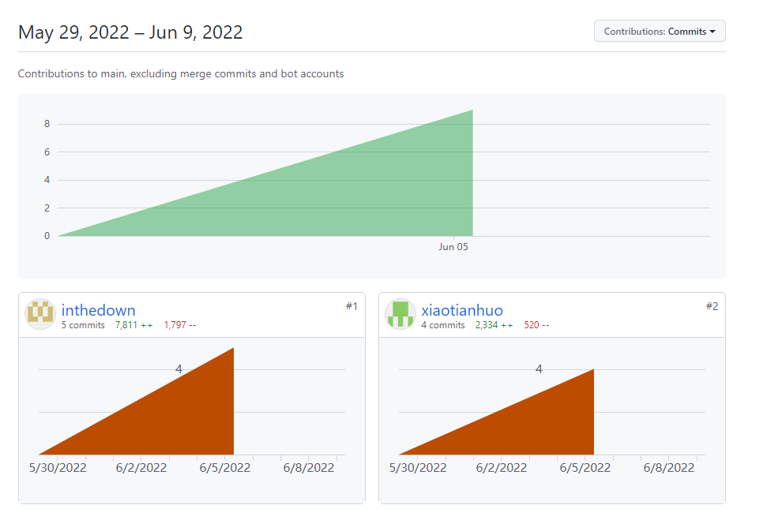

# [2020-2021学年第2学期]

# [**实 验 报 告**]


- 课程名称:编程语言原理与编译
- 实验项目:期末大作业
- 专业班级__<u>计算机1902</u>_
- 学生学号 <u>_31901050_ 31901298_</u>
- 学生姓名 <u>饶黎明 孙天熔</u>
- 实验指导教师:郭鸣

| 姓名   | 学号     | 班级       | 任务                             | 权重 |
| ------ | -------- | ---------- | -------------------------------- | ---- |
| 饶黎明 | 31901050 | 计算机1902 | 编译器（主要）、测试、文档       | 1.0  |
| 孙天熔 | 31901298 | 计算机1902 | 解释器（主要）、测试、文档、注释 | 0.9  |

成员代码提交日志




1. 项目自评等级:(1-5) 请根据自己项目情况填写下表

   （完善程度：个人认为实现的完善程度，个人花费的工作量等
   	难度：实现的困难程度，工作量大小，老师定义的困难程度等

| 解释器                | 完善程度 | 难度 |
| --------------------- | -------- | ---- |
| boolean类型           | 5        | 1    |
| dountil循环           | 5        | 1    |
| dowhile循环           | 5        | 1    |
| for循环               | 4        | 3    |
| 三目运算              | 5        | 1    |
| 自增自减（++/--)      | 4        | 4    |
| switch  case  default | 4        | 2    |

| 编译器                | 完善程度 | 难度 |
| --------------------- | -------- | ---- |
| boolean类型           | 5        | 1    |
| dountil循环           | 5        | 1    |
| dowhile循环           | 5        | 1    |
| for循环               | 4        | 2    |
| 三目运算              | 5        | 1    |
| 自增自减（++/--)      | 3        | 3    |
| switch  case  default | 3        | 4    |

2. 项目说明

   - 整体文件架构

     test文件夹             测试集

     Absyn.fs                 抽象语法

     CLex.fsl          		fslex词法定义

     CPar.fsy             	fsyacc语法定义

     Parse.fs                 语法解析器

     Interp.fs                 解释器

     interpc.fsproj        项目文件

     Contcomp.fs         编译器

     Machine.fs            指令定义

     microcc.fsproj      编译器项目文件

   - 项目运行

     **解释器：**

     dotnet restore interpc.fsproj //可选

     dotnet clean interpc.fsproj  //可选

     dotnet build -v n interpc.fsproj //构建，-v n查看详细生成过程

     ./bin/Debug/net5.0/interpc.exe  测试的文件 参数

     dotnet run -p interpc.fsproj 测试的文件 参数

     dotnet run -p interpc.fsproj -g 测试的文件 参数 //显示token AST 等调试信息  

     **编译器：**

     dotnet restore microcc.fsproj

     dotnet clean microcc.fsproj

     dotnet build microcc.fsproj //构建编译器

     dotnet run -p microcc.fsproj 测试的文件 //执行编译器

     ./bin/Debug/net5.0/microcc.exe 测试的文件 //直接执行

     

   - 主要实现了以下功能：

     - Boolean类型

       ```c
       void main(Int n) {
          Bool b = true;
          print("%d",b);
       }//解释器
       
       void main()
       {
           bool b;
           b = true;
           print("%d",b);
       
       }//编译器
       
       ```
     
       
     
       
     
       
     
     - DoUntil
   
       ```c
       void main(int n) {
           int i;
           i=0;
           do{
               print("%d",i);
               i = i+1;
           }  
           until(i>n);
       }//解释器
       
       
       
       void main() {
           int i;
           i=0;
           do{
               print("%d",i);
               i = i+1;
           }until(i>10);
       }//编译器
       
       ```
     
       
     
       
     
     - DoWhile
     
       ```c
       void main(int n) {
           int i;
           i=0;
           do {
               print("%d",i);
               i=i+1;
           }  
           while(i<=n);
       }//解释器
       
       
       void main() {
           int i;
           i=0;
           do {
               print("%d",i);
               i=i+1;
           }while(i<=10);
       }//编译器
       
       
       ```
     
       
     
       
     
     - For
     
       ```c
       void main(int n) {
           int i;
           i=0;
           for( i = 0 ; i < n; i = i + 1){
               print("%d",i);
           }
       }//解释器
       
       void main() {
           int i;
           i=0;
           for( i = 0 ; i < 10;  i = i + 1){
               print("%d",i);
           }
       }//编译器
       
       
       ```
       
       
       
       
       
     - 三目运算
     
       ```c
       void main(int n) {
           int i;
           i =  n>10?0:1;
           print("%d",i);
       }//解释器
       
       void main() {
           int n;
           int i;
           n = 7;
           i =  n>10?0:1;
           print("%d",i);
       }//编译器
       
       ```
       
       
       
       
       
     - Switch Case
     
       ```c
       void main(int n) {
           int i;
           int j;
           int k;
           i=0;
           j=1;
           k=2;
           switch( n ){
               case 0 :  print("%d",i);
               case 1 :  print("%d",j);
               default : print("%d",k);
           }
       }//解释器
       
       
       void main() {
           int n;
           n = 1;
           switch( n ){
               case 0 :  print("%d",3);
               case 1 :  print("%d",5);
           }
       }//编译器
       
       ```
       
       
       
       
       
     - 自增自减
     
       ```c
       void main(int n) {
          int i;
          int a;
          i=0;
          do {
             print("%d", ++i);
          }  
          while(i<n);
          println;
          i=0;
          do {
              print("%d",i++);
          }  
          while(i<n);
          println;
          i=20;
          do {
             print("%d",i--);
          } 
          while(i>n); 
          println;
          i=20;
          do {
             print("%d",--i);
          }  
          while(i>n);
       }//解释器
       
       void main() {
          int i;
          i=5;
          print("%d", ++i);
          print("%d", i);
          print("%d", i++);
          print("%d", i);
       }//编译器
       
       ```
       
       
       
       
       
       
   
3. 解决技术要点说明
   - switch case

     ```
     let addLabel C : label * instr list =         
         match C with
         | Label lab :: _ -> (lab, C)
         | GOTO lab :: _  -> (lab, C)
         | _              -> let lab = newLabel() 
                             (lab, Label lab :: C)
     ```
     
     
     
     ```F#
      | Switch(e,cases)   ->
             let (labend, C1) = addLabel C 
             let rec everycase case  = 
                 match case with			//匹配条件
                 | Case(cond,body) :: tr ->
                     let (labnextbody,labnext,C2) = everycase tr //递归调用
                     let (label, C3) = addLabel(cStmt body varEnv funEnv (addGOTO labnextbody C2))  //编译语句
                     let (label2, C4) = addLabel(cExpr (Prim2 ("==",e,cond)) varEnv funEnv (IFZERO labnext :: C3)) //若条件相等 编译表达式
                     (label,label2,C4)
                 | Default( body ) :: tr -> 
                     let (labnextbody,labnext,C2) = everycase tr
                     let (label, C3) = addLabel(cStmt body varEnv funEnv (addGOTO labnextbody C2))
                     let (label2, C4) = addLabel(cExpr (Prim2 ("==",e,e)) varEnv funEnv (IFZERO labnext :: C3))
                     (label,label2,C4)
                 | [] -> (labend, labend,C1) //没有匹配就结束
             let (label,label2,C2) = everycase cases
             C2
         | Case(cond,body)  ->
             C
         | Default(body)    ->
             C
     ```
   
   
   
4. 心得体会（结合自己情况具体说明）
   - 大项目开发过程心得

     - 饶黎明：

       课程内容有点抽象,课外内容量大,大项目上手难度有点高,没有相似的内容可以借鉴,想要进一步提升困难.项目刚开始没有内容错误报告位置,自我改错难度也大,耗费时间长
   
     - 孙天熔：
   
       （1）课程相对难度较大，因为发的教材和老师教的语言不一致，导致一些地方并不能很好的联系起来。
   
       （2）平时作业也有些一知半解，并不能高质量的完成作业。
   
       （3）学习资料繁杂，有些看不懂。
   
       （4）大作业开发中较困难，难题较多，因此只做了一些基础内容。
   
   - 本课程建议
     
     
     
     - 孙天熔：

​						希望老师上课时能讲解一下作业内容，学习资料也能整理一下。